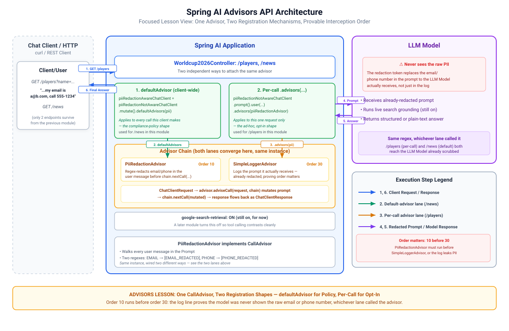

# 004-Advisors: Spring AI

What is new in this step is the **Advisors API**: a chain of cross-cutting concerns interceptors that sit between the controller and the Chat Model,
reading and mutating the request (and response) before the call is made, similar to filter chains.

> The Spring AI Advisors API provides a flexible and powerful way to intercept, modify, and enhance AI-driven interactions in your Spring
> applications. A common pattern when calling an AI model with user text is to append or augment the prompt with contextual data.
> 
> -- [Spring AI - Advisors API](https://docs.spring.io/spring-ai/reference/api/advisors.html)

The Spring AI framework wraps the user's `Prompt` in a `ChatClientRequest` together with an advisor context object. Each advisor in the chain
processes that request, potentially modifying it (or blocking it outright by filling the response itself). The final advisor, provided by the
framework, sends the request to the Chat Model. The response then passes back through the chain, converted into a `ChatClientResponse` that carries
the shared advisor context. Each advisor can process or modify the response on the way back.

* `PiiRedactionAdvisor`, a cross-cutting advisor registered as a `defaultAdvisor` on `geminiPiiRedactionAwareChatClient`. It scans each user message
  for email addresses and phone numbers and replaces them with `[EMAIL_REDACTED]` / `[PHONE_REDACTED]` before the prompt reaches the model

This module narrows the endpoint set to two (`/players` and `/news`) to keep the focus on the two advisor-registration mechanisms rather than
repeating every structured-output technique from `003-structured-output`. The rest of `003-structured-output`'s endpoints don't carry forward here.

> [!Note]
> **A note on grounding here.** `google-search-retrieval` is on for this module,
> so the model can run a live search before answering instead of relying only on its training
> data, and these fixtures are likely accurate as a result. Search grounding is the model's own
> judgement call, not a guaranteed lookup against a source you control, and nothing in the plain
> text response tells you whether it actually searched. `005-tool-calling` switches
> `google-search-retrieval` back off so the contrast with real tool calling is clean.

---

## 1. Architecture

[](./docs/architecture.svg)

---

## 2. Configuration

`application.yaml` is unchanged from 003. `GenAiConfig`'s code changes as follows

```java

@Bean
public ChatClient geminiPiiRedactionAwareChatClient(final ChatClient geminiPiiRedactionNotAwareChatClient,
		final PiiRedactionAdvisor piiRedactionAdvisor) {
	return geminiPiiRedactionNotAwareChatClient.mutate()
			.defaultAdvisors(piiRedactionAdvisor)
			.build();
}

@Bean
public ChatClient geminiPiiRedactionNotAwareChatClient(final ChatClient.Builder builder,
		@Value("${spring.ai.google.genai.chat.model}") final String model) {
	return enrichChatClientBuilder(builder)
			.defaultOptions(getGeminiChatOptions(model))
			.build();
}
```

---

## 3. Source Code

Two ways to use the advisor

#### 1. Chat client defaultAdvisor

As seen before in the configuration section

```java

@Bean
public ChatClient geminiPiiRedactionAwareChatClient(final ChatClient geminiPiiRedactionNotAwareChatClient,
		final PiiRedactionAdvisor piiRedactionAdvisor) {
	return geminiPiiRedactionNotAwareChatClient.mutate()
			.defaultAdvisors(piiRedactionAdvisor)
			.build();
}
```

#### 2. Per-call via `org.springframework.ai.chat.client.ChatClient.ChatClientRequestSpec#advisors(piiRedactionAdvisor)`

```java

@GetMapping("/players")
public Player getPlayer(final String name) {
	return geminiPiiRedactionNotAwareChatClient
			.prompt()
			.user(u -> u
					.text("What are {name}'s stats (goals, assists, cards and Man of the Match awards) during the World Cup 2026 group stage?")
					.param("name", name))
			.advisors(piiRedactionAdvisor)    // <------
			.call()
			.entity(Player.class, EntityParamSpec::validateSchema);
}
```

> [!Note]
> Advisor placement depends on execution scope. Universal policies like PII redaction belong in `GenAiConfig#enrichChatClientBuilder()` to enforce
compliance across all requests, _even though this module shows how to use it per-call_. Capabilities like chat memory conversation identifier could be
wired directly into individual calls.

### `PiiRedactionAdvisor`

The advisor implements `CallAdvisor`. On each request it walks the prompt's user messages, runs two regex patterns (email and phone), and replaces
matches with redaction tokens:

```java
public ChatClientResponse adviseCall(final ChatClientRequest request, final CallAdvisorChain chain) {
	final Prompt redactedPrompt = redactUserMessages(request.prompt());
	final ChatClientRequest updatedRequest = request.mutate()
			.prompt(redactedPrompt)
			.build();

	return chain.nextCall(updatedRequest);
}

private String redact(final String text) {
	String result = text;
	result = EMAIL.matcher(result).replaceAll("[EMAIL_REDACTED]");
	result = PHONE.matcher(result).replaceAll("[PHONE_REDACTED]");
	return result;
}
```

Because it runs at order 10, before the `SimpleLoggerAdvisor` at order 30, the log output shows the redacted prompt, proving the model never saw the
PII.

---

## 4. Running and Testing

* Start the application
* Check and run [Requests.http](src/test/resources/Requests.http)

Watch the `advisor: DEBUG` log on those calls. `PiiRedactionAdvisor` (order 10) runs first, so
`SimpleLoggerAdvisor` (order 30) prints the already-redacted prompt: the model never sees the email or phone number.

---

## 5. References

* [Spring AI - brief description of Advisors](https://docs.spring.io/spring-ai/reference/api/chatclient.html#_advisors)
* [Spring AI - complete guide of Advisors API](https://docs.spring.io/spring-ai/reference/api/advisors.html)
* [AI for Java Developers by Dan Vega](https://www.youtube.com/watch?v=FzLABAppJfM)

---

## 6. Exercise

Try the [exercise](EXERCISE.md) before opening `005-tool-calling`.

