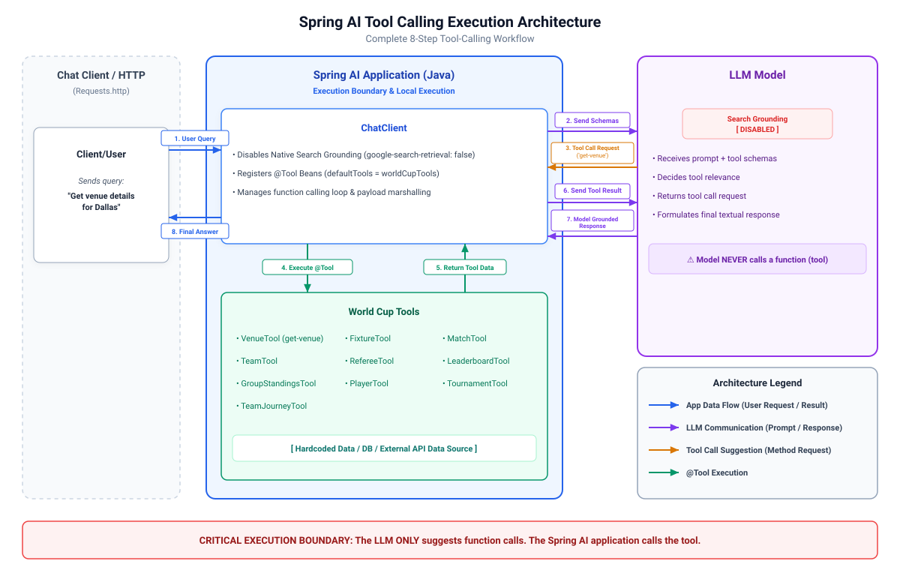

# 005-tool-calling: Spring AI

What is new in this step is **tool calling** or **function calling**: the model can suggest to your application to invoke functions you (or someone
else) define to fetch data **(to emphasize , the model never calls them, your application does)**. This module is the first to switch off Gemini's own
live search grounding (`google-search-retrieval: false` in the yaml) so the contrast is clean. From here on, any accuracy in an answer is attributable
to a specific tool you wrote, not to the model's own judgment call about whether to search.

> [!Note]
> Many people get this wrong and I have heard it in conversation a lot lately. So, for the third time.
>
> **Execution boundary:** The model never executes functions directly; your application controls and runs the code.

* A few `@Tool`-annotated components, one per concern (`TeamTool`, `VenueTool`, `FixtureTool`,
  `MatchTool`, `RefereeTool`, `GroupStandingsTool`, `TeamJourneyTool`, `PlayerTool`,
  `LeaderboardTool`, `TournamentTool`), to ground 2026 World Cup data.
* Tools wired as `defaultTools` in `GenAiConfig`,

> [!Note]
> **Why can I trust these fixtures now?** Not because the model got smarter: because a named tool answered instead, and the log proves it. The model
still does not know match results or venue facts on its own; it knows to ask a tool for them.

> [!Warning]
> Search grounding off, nothing to fall back on, so it goes back to guessing if the question is not covered by a tool.

---

## 1. Architecture

[](./docs/architecture.svg)

---

## 2. Configuration

`application.yaml` turns off Gemini's built-in search grounding, the one setting that changes between this module and 002-005:

```yaml
spring:
  ai:
    google:
      genai:
        chat:
          google-search-retrieval: false
          include-server-side-tool-invocations: false
```

`GenAiConfig` gains a `worldCupTools` bean composing all tool components

```java

@Bean
public List<Object> worldCupTools(final VenueTool venueTool,
		final FixtureTool fixtureTool,
		final MatchTool matchTool,
		final TeamTool teamTool,
		final GroupStandingsTool groupStandingsTool,
		final RefereeTool refereeTool,
		final TeamJourneyTool teamJourneyTool,
		final TournamentTool tournamentTool,
		final PlayerTool playerTool,
		final LeaderboardTool leaderboardTool) {
	return List
			.of(venueTool,
					fixtureTool,
					matchTool,
					teamTool,
					groupStandingsTool,
					refereeTool,
					teamJourneyTool,
					tournamentTool,
					playerTool,
					leaderboardTool);
}

@Bean
public ChatClient geminiToolsAwareChatClient(final ChatClient geminiToolsNotAwareChatClient,
		final List<Object> worldCupTools) {
	return geminiToolsNotAwareChatClient.mutate()
			.defaultTools(worldCupTools)
			.build();
}
```

Every tool is available on every client. The model decides on its own, per question, whether one is relevant.

---

## 3. Source Code

Each tool is a `@Component` with one or more `@Tool`-annotated methods. Spring AI sends the tool's name, description and parameter descriptions to the
model as a function schema:

```java

@Tool(name = "get-venue", description = "Get venue details for a host city of the World Cup 2026")
public Venue getVenue(
		@ToolParam(description = "The host city name, e.g., 'Dallas', 'Mexico City', 'Toronto'", required = true) final String city) {
	return VENUES.getOrDefault(city.toLowerCase().trim(), new Venue("Unknown", city, "Unknown", 0));
}
```

The tools return data hardcoded in each class. In a real application the same `@Tool` method could call a database or an external API instead; the
model does not know or care where the data comes from.

> [!Note]
> Ask "pick the must-watch match" is a matter of opinion, not a fact a tool can look up. It keeps relying on the model's own judgment, and with
> search grounding off in this module, that means it goes back to guessing.

---

## 4. Running and Testing

* Start the application
* Check and run [Requests.http](src/test/resources/Requests.http)

Watch the `advisor: DEBUG` log. When the model decides to call a tool, the log shows the tool invocation request and the tool response before the
final answer. Run the identical commands against `008-chat-memory` and compare: there, an accurate answer means the model chose to search live; here,
it means a specific named tool ran and you can see it happen in the log.

---

## 5. References

* [Tool Calling](https://docs.spring.io/spring-ai/reference/api/tools.html)

---

## 6. Exercise

Try the [exercise](EXERCISE.md) before opening `006-tool-search`.
