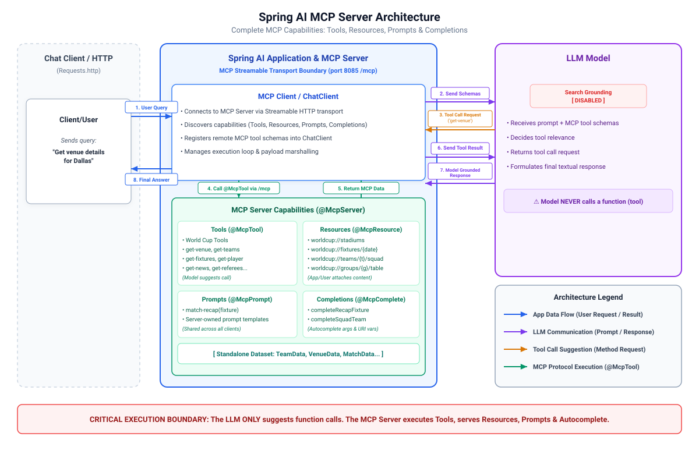

# 007-mcp-client: Spring AI

> [!CAUTION]
> Very sharp tool, do *not* cut yourself, vulnerable to
> * Naming attacks
> * Shadowing attacks
> * Context poisoning
> * Rug pulls

The `@Tool` classes are gone entirely. What is new in this step is the **Model Context Protocol (MCP)**: grounding data no longer lives inside this
application at all. A separate server (`007-mcp-server`) publishes every tool, resource, prompt and completion, and this module is a genuinely thin
client with no local tool logic of its own.

> [!NOTE]
> Where did this data come from?
>
> MCP Server.

> [!NOTE]
> Obviously, you can still have local tools within this module, even though it also consumes the MCP tools.
> Just be careful with name collision. Check `mcpToolNamePrefixGenerator()`
> in [GenAiConfig.java](src/main/java/ai/spring/learning/worldcup/GenAiConfig.java)

Start the server first:

```bash
cd ../007-mcp-server && ./mvnw spring-boot:run
```

---

## 1. Architecture

[](./docs/architecture.svg)

---

## 2. Configuration

```xml

<dependency>
  <groupId>org.springframework.ai</groupId>
  <artifactId>spring-ai-starter-mcp-client</artifactId>
</dependency>
```

One connection to the server over Streamable HTTP, plus search grounding switched off (same reasoning as `005-tool-calling`: any accuracy here should
be attributable to MCP, not to the model searching on its own):

```yaml
spring:
  ai:
    google:
      genai:
        chat:
          google-search-retrieval: false
          include-server-side-tool-invocations: false
    mcp:
      client:
        enabled: true
        type: SYNC
        request-timeout: 30s
        toolcallback:
          enabled: true
        streamable-http:
          connections:
            worldcup:
              url: http://localhost:8085
              endpoint: /mcp
```

The starter auto-configures an `McpSyncClient` per connection and a `SyncMcpToolCallbackProvider` that turns every server tool into a Spring AI
`ToolCallback`. `GenAiConfig` resolves it through `ObjectProvider<SyncMcpToolCallbackProvider>`

---

## 3. Source Code

Tools are mapped via `ObjectProvider<SyncMcpToolCallbackProvider>`

```java

@Bean
public List<Object> worldCupTools(final ObjectProvider<SyncMcpToolCallbackProvider> mcpToolCallbackProvider) {
	return mcpToolCallbackProvider.stream()
			.map(SyncMcpToolCallbackProvider::getToolCallbacks)
			.flatMap(Arrays::stream)
			.filter(Objects::nonNull)
			.map(Object.class::cast)
			.toList();
}
```

The controller is grouped by which MCP capability each endpoint demonstrates:

### Tools: plain prompts, the model decides when to call one

The same twelve questions as `005-tool-calling`, now grounded by the MCP server's tools instead of in-application ones, plus `get-controversies`.

```
GET /teams?group=             GET /matches/stats?fixture=       GET /players/leaderboard?category=
GET /venues?city=             GET /referees                     GET /news?team=
GET /fixtures?team=&stage=    GET /groups/standings?group=      GET /controversies?team=
GET /featured-match?stage=    GET /teams/journey?team=
GET /players?name=            GET /matches/result?fixture=
```

> [!Warning]
> `/featured-match` still has no matching tool on the server either, so it still guesses.

### Resources: the application decides when to fetch these, not the model

```java
final McpSchema.ReadResourceResult resource = mcpSyncClients.getFirst()
		.readResource(new McpSchema.ReadResourceRequest("worldcup://teams/" + team + "/squad"));
```

* `GET /squad?team=`: `worldcup://teams/{team}/squad`
* `GET /schedule?date=`: `worldcup://fixtures/{date}`
* `GET /stadiums`: `worldcup://stadiums`, returned as-is, no model call at all
* `GET /standings?group=`: `worldcup://groups/{group}/standings`

### Prompts: templates owned by the server

```java
final McpSchema.GetPromptResult prompt = mcpSyncClients.getFirst()
		.getPrompt(new McpSchema.GetPromptRequest("match-recap", Map.of("fixture", fixture)));
```

* `GET /recap?fixture=`: fetches the server's `match-recap` prompt instead of keeping the prompt text in this application.

### Completions: autocomplete over small known sets, no LLM call

```bash
curl "http://localhost:8080/autocomplete/squad-teams?prefix=M"
["Morocco","Mexico"]
```

> [!Note]
> None of these touch the model at all; they are pure client-to-server MCP calls.

---

## 4. Running and Testing

* Start the application
* Check and run [Requests.http](src/test/resources/Requests.http)

Watch the server logs while calling: every tool invocation, resource read, prompt fetch and completion arrives over MCP, never in-process.

---

## 5. References

* [MCP Client Boot Starter](https://docs.spring.io/spring-ai/reference/api/mcp/mcp-client-boot-starter-docs.html)
* [Streamable HTTP](https://modelcontextprotocol.io/specification/2025-06-18/basic/transports#streamable-http)
* [Spring AI Tool Search Tool (Tzolov)](https://spring.io/blog/2025/12/11/spring-ai-tool-search-tools-tzolov)
* [AI for Java Developers by Dan Vega](https://www.youtube.com/watch?v=FzLABAppJfM)

---

## 6. Exercise

Try the [exercise](EXERCISE.md) before opening `008-chat-memory`.

