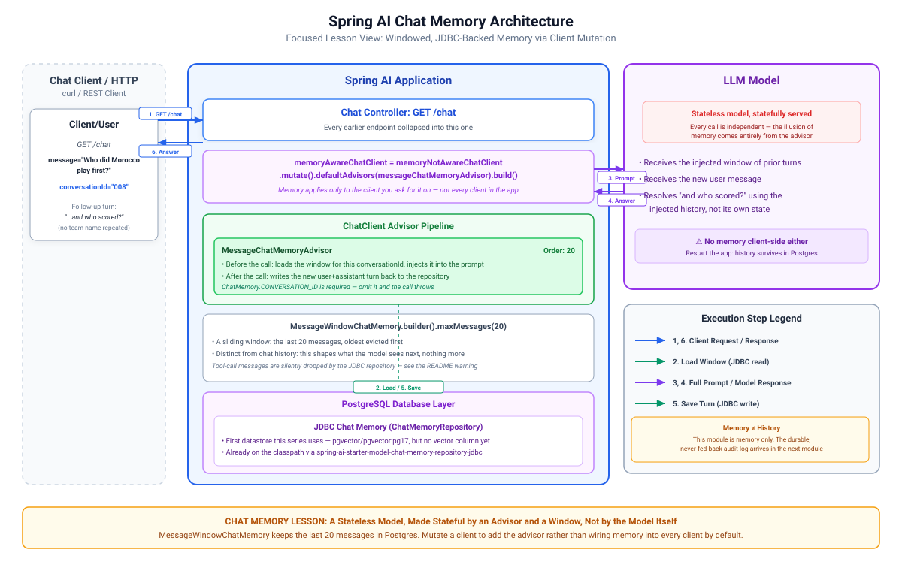

# 008-chat-memory: Spring AI

What is new in this module is that we give our application a **chat memory**: the model remembers context from previous turns in the same
conversation, so a fan can ask follow-up questions without repeating themselves.

LLMs are stateless. Each call is independent with no memory of the last. Spring AI's `ChatMemory` abstraction fixes this by storing recent messages in
a repository and injecting them into the next prompt via a `MessageChatMemoryAdvisor`. The model sees the conversation history and can reference what
was said before.

Spring AI separates chat memory from chat history:

* **Chat memory** is the active context passed to the model: a sliding window of recent interactions injected into each new prompt.
  MessageWindowChatMemory retains the last N messages (20 by default) and drops older ones. In this setup, Postgres stores this window through a
  JDBC-backed `ChatMemoryRepository`, covering both user and assistant messages.
* **Chat history** is the complete log of the user's visible interactions, recorded for UI display, auditing, or compliance. It strictly logs user
  inputs and application replies, storing no internal assistant messages. Spring AI advises against using `ChatMemory` for full history, so Chat
  history would require a custom persistence.

>[!Note]
> Chat memory is for **model context**, while chat history is for **user-facing UI**.

This module handles chat memory exclusively.

Added on top of 004:

* A `MessageChatMemoryAdvisor` wired on a new `geminiMemoryAwareChatClient` built by mutating another client, so memory only applies to endpoints that
  need it
* `MessageWindowChatMemory` with a sliding window of 20 messages, backed by `ChatMemoryRepository` so memory survives restarts
* All endpoints have been collapsed into one `/chat`.

> [!Note]
> Memory Management: `MessageWindowChatMemory` automatically manages the maximum size of active conversations by trimming and replacing the message
list. While NoSQL databases (Redis, MongoDB, Cassandra) natively support Time-To-Live expiration via out-of-the-box properties, relational databases
like PostgreSQL do not. To achieve TTL behaviour in SQL, you must implement a custom cleanup strategy, such as a Spring `@Scheduled` ≈task, to purge
abandoned conversations.

> [!Warning]
> `MongoChatMemoryRepository`, `JdbcChatMemoryRepository` and `CassandraChatMemoryRepository` do not store tool-calling messages. `AssistantMessage`
instances containing tool calls and `ToolResponseMessage` instances are silently filtered out on save and will not appear in the retrieved
conversation history. If your application uses tool calling, consider
the [Spring AI Session](https://spring-ai-community.github.io/spring-ai-session/latest/) project and
the [JDBC session store](https://spring-ai-community.github.io/spring-ai-session/latest/session-jdbc/), which properly persist all message types.

> [!Note]
> **A note on grounding here.** `google-search-retrieval` is on for this module,
> so the model can run a live search before answering instead of relying only on its training
> data, and these fixtures are likely accurate as a result. Search grounding is the model's own
> judgement call, not a guaranteed lookup against a source you control, and nothing in the plain
> text response tells you whether it actually searched. `005-tool-calling` switches
> `google-search-retrieval` back off so the contrast with real tool calling is clean.
---

## 1. Architecture

[](./docs/architecture.svg)

---

## 2. Configuration

`docker-compose.yml` (repository root) gains a `postgres` service, `pgvector/pgvector:pg17`, port `5432`: the first datastore this series uses.
`application.yaml` adds the JDBC chat memory repository plus the datasource it needs to reach that container, on top of everything from 004:

```yaml
spring:
  ai:
    chat:
      memory:
        repository:
          jdbc:
            initialize-schema: always
  datasource:
    url: jdbc:postgresql://localhost:5432/worldcup
    username: worldcup
    password: worldcup
```

`GenAiConfig` gains two beans. `messageChatMemoryAdvisor` builds `MessageWindowChatMemory` over the auto-configured `ChatMemoryRepository` (available
because `spring-ai-starter-model-chat-memory-repository-jdbc` is on the classpath):

```java

@Bean
public MessageChatMemoryAdvisor messageChatMemoryAdvisor(final ChatMemoryRepository chatMemoryRepository) {
	final var chatMemory = MessageWindowChatMemory.builder()
			.chatMemoryRepository(chatMemoryRepository)
			.maxMessages(20)
			.build();

	return MessageChatMemoryAdvisor.builder(chatMemory)
			.order(20)
			.build();
}
```

`geminiMemoryAwareChatClient` mutates the existing not-memory-aware client to add that advisor, so memory applies only where you ask for it, not to
every client:

```java

@Bean
public ChatClient geminiMemoryAwareChatClient(final ChatClient geminiMemoryNotAwareChatClient,
		final MessageChatMemoryAdvisor messageChatMemoryAdvisor) {
	return geminiMemoryNotAwareChatClient.mutate()
			.defaultAdvisors(messageChatMemoryAdvisor)
			.build();
}
```

The `ChatMemory.CONVERSATION_ID` parameter is **required** on every call that uses the memory client. Calls that omit it throw at runtime; there is no
default conversation ID.

---

## 3. Source Code

### `/chat` endpoint

All endpoints now are removed and we have a new endpoint `/chat`

```java

@GetMapping("/chat")
public String chat(final String conversationId, final String message) {
	return geminiMemoryAwareChatClient
			.prompt()
			.user(message)
			.advisors(advisor -> advisor.param(ChatMemory.CONVERSATION_ID, conversationId))
			.call()
			.content();
}
```

---

## 4. Running and Testing

You need Postgres running on `localhost:5432` (`docker compose up -d postgres` from the repository root; the automated tests spin up a `postgres:17`
container via Testcontainers instead).

* `docker compose up -d postgres`
* Start the application
* Check and run [Requests.http](src/test/resources/Requests.http)

Watch the `advisor: DEBUG` log. `MessageChatMemoryAdvisor` loads the stored messages from Postgres and injects them into the prompt before the model
is called.

---

## 5. References

* [Spring AI brief description of chat memory](https://docs.spring.io/spring-ai/reference/api/chatclient.html#_chat_memory)
* [Spring AI complete guide of Chat Memory](https://docs.spring.io/spring-ai/reference/api/chat-memory.html)
* [AI for Java Developers by Dan Vega](https://www.youtube.com/watch?v=FzLABAppJfM)

---

## 6. Exercise

Try the [exercise](EXERCISE.md) before opening `010-embedding` and `010-vector-store-rag`.

