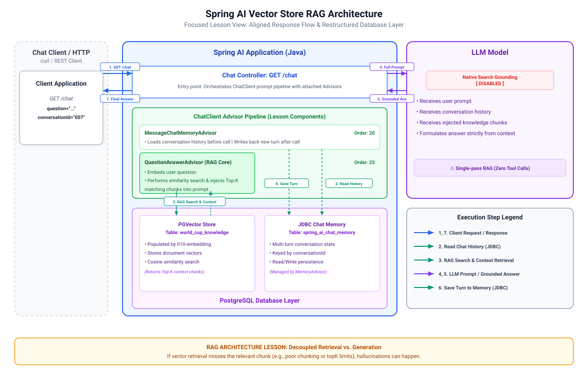

# 010-vector-store-rag: Spring AI

This module skips MCP entirely and returns to a plain Spring Boot app, replacing tool-calling grounding with retrieval-augmented generation.
`010-embedding` (a separate, standalone module, see its README) populates the PGVector store this app reads from; run it first. Prior to the request
reaches the model, this app runs a similarity search against the vector store and injects the matching chunks into the prompt; the model then answers
from that context instead of (or in addition to) its own training data. This is the simplest form of RAG, one retrieval pass, augment prompt then call
model.


> [!Note]
> **RAG does not require a vector store.** The core concept is simply fetching relevant info first and feeding it into the prompt. How you retrieve
that data is entirely an implementation choice.
>
> Ways to retrieve data include:
> * Vector search to find text with similar meanings, which works well for unstructured prose but often misses exact terms.
> * Keyword search through tools like BM25 or Postgres to match exact words, making it far better for names, IDs, and numbers.
> * Tool calling, as seen in setups like `005-tool-calling`, to fetch precise data deterministically with zero vector search involved.
> * Direct lookups via SQL queries or REST APIs to pull exact, structured records.
> * Hybrid search, to come in `011-hybrid-search-rag`, combining vector and keyword techniques to capture both general concepts and exact terms.
>
> Vector stores are popular for prose-heavy content, but standard database queries or tool calls work just as well for structured data. RAG only
requires a retrieval step, not a vector database.

* `QuestionAnswerAdvisor`, backed by a `VectorStore` reading the same PGVector table
  `010-embedding` populates: retrieval and generation in one advisor
* One `ChatClient`
* `ChatHistoryRepository` and `ChatHistorySchemaInitializer`: a durable, Postgres-backed audit log of every question and answer, separate from
  `MessageChatMemoryAdvisor`'s windowed memory. `GET /chat/{conversationId}` reads it back as plain JSON, no LLM call
* Two endpoints: `GET /chat?question=&conversationId=` and `GET /chat/{conversationId}`

> [!NOTE]
> Where did this data come from?
>
> Knowledge base embedded in vector db.
---

## 1. Architecture

[](./docs/architecture.svg)

---

## 2. Configuration

```xml

<dependency>
  <groupId>org.springframework.ai</groupId>
  <artifactId>spring-ai-starter-model-transformers</artifactId>
</dependency>
<dependency>
<groupId>org.springframework.ai</groupId>
<artifactId>spring-ai-starter-vector-store-pgvector</artifactId>
</dependency>
<dependency>
<groupId>org.springframework.ai</groupId>
<artifactId>spring-ai-vector-store-advisor</artifactId>
</dependency>
```

```yaml
spring:
  ai:
    google:
      genai:
        api-key: ${GOOGLE_AI_API_KEY}
        chat:
          model: gemini-3.1-pro-preview
          flash-model: gemini-3.5-flash
          flash-lite-model: gemini-3.1-flash-lite
    chat:
      memory:
        repository:
          jdbc:
            initialize-schema: always
    vectorstore:
      pgvector:
        initialize-schema: true
        table-name: world_cup_knowledge
  datasource:
    url: jdbc:postgresql://localhost:5432/worldcup
    username: worldcup
    password: worldcup
```

`spring-ai-starter-model-transformers` is here too, not just in `010-embedding`: reading from the vector store means embedding the incoming question
before comparing it against stored chunks, so this app needs a working `EmbeddingModel` bean as much as the ingestion job does.

> [!Warning]
> The `EmbeddingModel` used in `010-embedding` needs to be used in this module too. Otherwise, the retrieval will fail.

```java

@Bean
public QuestionAnswerAdvisor questionAnswerAdvisor(final VectorStore vectorStore) {
	return QuestionAnswerAdvisor.builder(vectorStore)
			.order(25)
			.build();
}
```

Advisor Orders matter: `PiiRedactionAdvisor` (10) must run before
`MessageChatMemoryAdvisor` (20) so raw PII never gets written into Postgres-backed chat memory, and both run before `QuestionAnswerAdvisor` (25) and
`SimpleLoggerAdvisor` (30).

---

## 3. Source Code

`QuestionAnswerAdvisor` does the two RAG steps around every call: before the request reaches the model, it runs a similarity search against the vector
store and injects the matching chunks into the prompt; the model then answers from that context instead of (or in addition to) its own training data.
This is the simplest, single-shot form of RAG: one retrieval pass, no rules, no agentic loop.

```java

@GetMapping("/chat")
public String chat(final String question, final String conversationId) {
	return geminiChatClient.prompt().user(question)
			.advisors(advisor -> advisor.param(ChatMemory.CONVERSATION_ID, conversationId)).call()
			.content();
}
```

The full domain model from `005-tool-calling` (`Match`, `Venue`, `Player`, `Referee`,
`TeamStanding`, `TeamJourneyMatch`, `TeamNews`, `MatchResult`, `MatchStats`, `Fixture`,
`Controversy`) carries forward into this module's `model` package too, even though `/chat` itself answers in prose: the knowledge base content spans
all of it.

---

## 4. Running and Testing

Postgres and `010-embedding` (at least once) must both have run first:

* `docker compose up -d postgres`
* Start the application
* Check and run [Requests.http](src/test/resources/Requests.http)

Watch the `advisor: DEBUG` log: `QuestionAnswerAdvisor` shows the retrieved chunks it injected into the prompt before the model answered.

> [!Warning]
> When asking "Who are some of the players in Morocco's squad?", the LLM responds that it cannot answer based on the provided context—even though the
data exists in our raw source files!
>
> What is actually happening under the hood:
>
> * Vector Retrieval Failed: Because of a naive chunking strategy that grouped several team squads into single large chunks without distinct
    structural anchors, the embedding model diluted the semantic score for Morocco. As a result, PGVector's default topK=4 similarity search retrieved
    chunks for Spain, Senegal, and England instead.
>
> * Guardrails Kept the System Honest: Bound by the system prompt ("Answer only from the context provided..."), the LLM correctly refused to
    hallucinate the roster when the chunk was missing from its context.
>
> Key Takeaway: Perfect prompt engineering and guardrails cannot compensate for poor document retrieval. Chunking strategy, document structure, and
Retrieval Top-K tuning are critical to building effective RAG systems!

---

# 5. References

* [Retrieval Augmented Generation](https://docs.spring.io/spring-ai/reference/api/retrieval-augmented-generation.html)
* [AI for Java Developers by Dan Vega](https://www.youtube.com/watch?v=FzLABAppJfM)

---

## 6. Exercise

Try the [exercise](EXERCISE.md) before opening `011-hybrid-search-rag`.
