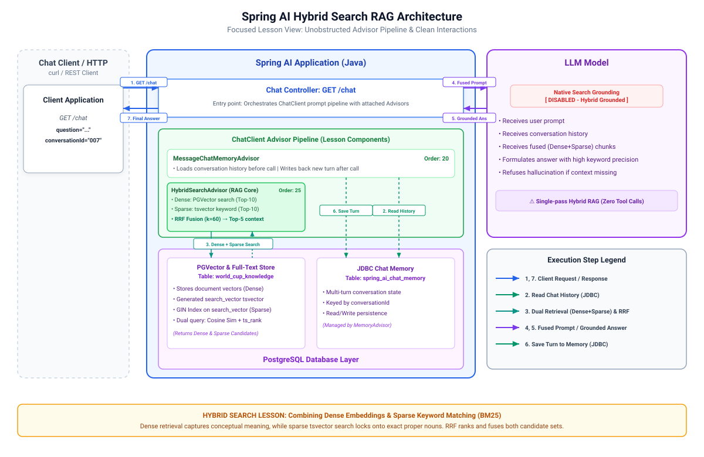

# 011-hybrid-search-rag: Spring AI

> [!note]
>Developers will most likely use a hosted vector store that handles this kind of search internally. While you may not need to implement this directly,
it is still important to understand how the underlying mechanics work.

Builds directly on `010-vector-store-rag`. Same route, `GET /chat?question=&conversationId=`, same contract; only what grounds it underneath changes.
`HybridSearchAdvisor` replaces
`QuestionAnswerAdvisor` in the same advisor slot.

**The problem it fixes:** `010-vector-store-rag`'s `/chat` grounds every answer purely through vector similarity search — the question gets embedded,
and PGVector finds chunks whose embeddings are closest. Embeddings are good at meaning but bad at exact tokens: they'll happily conflate
"Mbappé" with other French forwards, or blur "Estadio Azteca" with "Aztec-era history," because the embedding space represents semantic similarity,
not string identity. So a fan asking "who scored for Morocco vs Haiti" can retrieve a chunk that's topically close but names the wrong player, purely
because proper nouns embed poorly.

**What hybrid search does:**
> [!note]
> Fixes vector blind spot

Runs two retrieval methods over the same question and merge them:

1. **Dense retrieval**, what `010-vector-store-rag` already has: vector similarity search (PGVector).
2. **Sparse retrieval**, keyword/full-text search (BM25-style ranking), which nails exact terms like player names, team names and stadiums because
   it's matching tokens, not vectors.

The two ranked lists are merged with [Reciprocal Rank Fusion](HOW_RECIPROCAL_RANK_FUSION_WORKS.md):
a chunk that ranks well in *either*
list surfaces, and one that ranks well in *both* rises to the top.

Added on top of `010-vector-store-rag`:

* Postgres's own full-text search (a generated `tsvector` column plus a GIN index) on the same
  `world_cup_knowledge` table `010-embedding` already populated: no new datastore
* `HybridSearchAdvisor`, a custom advisor combining dense and sparse retrieval with Reciprocal Rank Fusion, replacing `QuestionAnswerAdvisor` in the
  same slot
* `ChatHistoryRepository` and `ChatHistorySchemaInitializer`, carried forward from `010-vector-store-rag`: `GET /chat/{conversationId}` still reads
  back the durable audit log, unaffected by which retrieval technique grounds `/chat`

---

## 1. Architecture

[](./docs/architecture.svg)

---

## 2. Configuration

No new dependency needed: full-text search is built into Postgres, not a separate library. In fact, this module drops `spring-ai-vector-store-advisor`
from `010-vector-store-rag`'s dependencies, since `QuestionAnswerAdvisor` isn't used anymore.

```yaml
worldcup:
  hybrid-search:
    full-text-column: search_vector
    full-text-index: world_cup_knowledge_search_idx
    dense-top-k: 10
    sparse-top-k: 10
    fused-top-k: 5
    reciprocal-rank-fusion-k: 60
```

`FullTextSearchSchemaInitializer` runs once at startup and is idempotent (`IF NOT EXISTS`
throughout), so restarting this app never re-runs a migration that already succeeded:

```java
jdbcTemplate.execute("ALTER TABLE %s ADD COLUMN IF NOT EXISTS %s tsvector GENERATED ALWAYS AS (to_tsvector('english', content)) STORED"
		.formatted(tableName, fullTextColumn));
		jdbcTemplate.

execute("CREATE INDEX IF NOT EXISTS %s ON %s USING GIN (%s)".formatted(fullTextIndex, tableName, fullTextColumn));
```

A generated column keeps itself in sync: Postgres recomputes `search_vector` from `content`
automatically on every insert, no trigger or manual backfill needed.

---

## 3. Source Code

`HybridSearchAdvisor` implements `CallAdvisor` and runs both retrieval methods over the question, then fuses:

```java
private List<RankedDocument> denseResults(final String question) {
	final List<Document> documents = vectorStore.similaritySearch(SearchRequest.builder().query(question).topK(denseTopK).build());
  ...
}

private List<RankedDocument> sparseResults(final String question) {
	// Convert "Morocco squad players" -> "Morocco | squad | players"
	final String orQuery = Arrays.stream(question.split("\\W+"))
			.filter(w -> !w.isBlank())
			.collect(Collectors.joining(" | "));

	final String sql =
			"SELECT id, content FROM %s WHERE %s @@ to_tsquery('english', ?) ORDER BY ts_rank(%s, to_tsquery('english', ?)) DESC LIMIT ?"
					.formatted(tableName, fullTextColumn, fullTextColumn);

	return jdbcTemplate
			.query(sql, (rs, rowNum) -> new RankedDocument(rs.getString("id"), rs.getString("content"), rowNum + 1), orQuery, orQuery, sparseTopK);
}
```

Reciprocal Rank Fusion: `score(doc) = Σ 1 / (reciprocalRankFusionK + rank)`, summed across every ranked list the document appears in, so a document
ranked highly by both methods scores higher than one ranked highly by only one. These fused, deduplicated top results replace what
`QuestionAnswerAdvisor` would have retrieved.

---

## 4. Running and Testing

Same as `010-vector-store-rag`: Postgres and `010-embedding` (at least once) must both have run first.

* `docker compose up -d postgres`
* Start the application
* Check and run [Requests.http](src/test/resources/Requests.http)

Watch the `advisor: DEBUG` log: `HybridSearchAdvisor` shows the fused context it injected into the prompt, drawn from both the vector and keyword
searches.

---

## 5. References

* [Postgres full-text search ](https://www.postgresql.org/docs/current/textsearch.html)
* [What is BM25 (Best Matching 25) Algorithm](https://www.geeksforgeeks.org/nlp/what-is-bm25-best-matching-25-algorithm)
* [Wikipedia -Okapi BM25](https://en.wikipedia.org/wiki/Okapi_BM25)

---

## 6. Exercise

Try the [exercise](EXERCISE.md) before opening `012-agentic-rag`.
