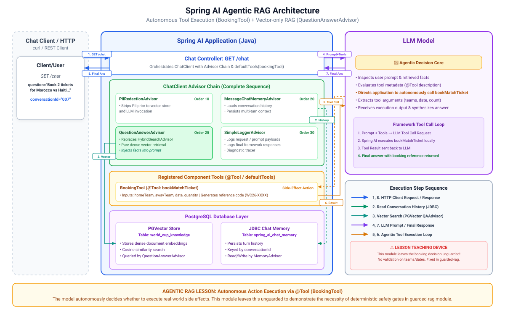

# 012-Agentic-RAG: Spring AI

**What's new here:** `BookingTool`, a `@Tool`-annotated method for booking World Cup 2026 match tickets. Unlike a lookup, booking has a side effect:
it's a real-world action taken on the fan's behalf, not information retrieved for them. That's a materially different kind of decision than anything
`005-tool-calling` or `007-mcp-server` exposed as a tool (which were all lookups), and a materially different kind of decision than retrieval too:
getting a fact wrong is a bad answer; taking an unwanted action is a bad *thing that actually happened*. This is what earns the name
"agentic" here: the model decides, on its own judgement, whether a fan's message is an actual booking request worth acting on.

This is deliberately left unguarded. Nothing stops the model deciding wrong: booking when the fan was only musing about a match ("I'd love to see
Morocco play"), not booking when clearly asked, booking against a fixture that doesn't exist, or recording the same booking twice. Those rough edges
are the point, matching the series' oldest teaching device (001 hallucinates, 006 fixes it with tools): `013-guarded-rag` is the fix, wrapping the
booking decision in deterministic gates rather than trusting the model's judgement on something that has real consequences.

> [!Note]
> `HybridSearchAdvisor`'s hand-rolled fusion is gone, replaced by `QuestionAnswerAdvisor`,
> the same plain vector-only advisor `010-vector-store-rag` used before `011-hybrid-search-rag`
> existed.
> `011-hybrid-search-rag` already teaches the fusion technique on its own; a real deployment would
> normally get hybrid search from its hosted vector store rather than hand-rolling Reciprocal Rank
> Fusion, so carrying that code into every later module would just repeat the lesson, not add one.

* `BookingTool`, a `@Component` with one `@Tool`-annotated method, registered via
  `defaultTools(...)`
  alongside the advisor chain

Unchanged from `011-hybrid-search-rag`: `ChatHistoryRepository` and `ChatHistorySchemaInitializer`, still recording every question and answer,
including whichever ones a booking call produces

Dropped from `011-hybrid-search-rag`: `HybridSearchAdvisor`, `FullTextSearchSchemaInitializer`, and
`worldcup.hybrid-search.*` configuration, see above. Unchanged: `PiiRedactionAdvisor` (10),
`MessageChatMemoryAdvisor` (20), `SimpleLoggerAdvisor` (30), now at order 25 `QuestionAnswerAdvisor`
in place of `HybridSearchAdvisor`.

---

## 1. Architecture

[](./docs/architecture.svg)

---

## 2. Configuration

No new dependency: `@Tool` and `@ToolParam` are part of the core Spring AI chat client artefact already on the classpath from
`spring-ai-starter-model-google-genai`, the same as `005-tool-calling`
and `007-mcp-server` used. No `worldcup.hybrid-search.*` configuration either, it's gone along with
`HybridSearchAdvisor`.

---

## 3. Source Code

The tool method is the entire booking surface the model can reach:

```java

@Tool(description = "Book World Cup 2026 match tickets for the fan. Only call this when the fan "
		+ "has clearly asked to book or attend a specific fixture and you know both teams; do not "
		+ "call it for a general question about a match, only an actual booking request.")
public String bookMatchTicket(
		@ToolParam(description = "The home team name") final String homeTeam,
		@ToolParam(description = "The away team name") final String awayTeam,
		@ToolParam(description = "The match date, however the fan phrased it") final String date,
		@ToolParam(description = "Number of tickets") final int quantity) {
	final String reference =
			"WC26-" + UUID.randomUUID().toString().substring(0, 8).toUpperCase(Locale.ROOT);
	log.info("Booking recorded: {} ticket(s) for {} vs {} on {}, reference {}", quantity, homeTeam,
			awayTeam, date, reference);
	return "Booked %d ticket(s) for %s vs %s on %s. Your booking reference is %s.".formatted(quantity,
			homeTeam, awayTeam, date, reference);
}
```

There's no real ticketing system behind this tutorial, so "booking" is a just log line and a generated reference, nothing more. What matters is what's
missing on purpose: no check that
`homeTeam` and
`awayTeam` name a real fixture, no validation of `date`, no duplicate-booking guard. The tool description is the only lever available to steer the
model's decision to call this at all; there's no code path that forces or blocks the call.

Registration, in `GenAiConfig`: the tool is additive, retrieval is back to `QuestionAnswerAdvisor`:

```java
final Advisor[] advisors = {new PiiRedactionAdvisor(10), messageChatMemoryAdvisor, // order 20
		questionAnswerAdvisor, // order 25
		new SimpleLoggerAdvisor(30)};

return builder.

defaultSystem(""" ... you have a bookMatchTicket tool ... """)
		.

defaultTools(bookingTool)
		.

defaultAdvisors(advisors);
```

`ChatClient`'s framework-controlled tool execution (the default, no extra configuration) handles the whole request-response-request loop: retrieval
still happens on every call via the advisor chain, and if the model's response is also a tool call, `bookMatchTicket` executes and its result goes
back to the model to fold into the final answer.

---

## 4. Running and Testing

Same as `011-hybrid-search-rag`: Postgres and `010-embedding` (at least once) must both have run first.

* `docker compose up -d postgres`
* Start the application
* Check and run [Requests.http](src/test/resources/Requests.http)

Watch `model.tool: DEBUG`: it shows whether `bookMatchTicket` actually got called for that particular question, and with what parameters the model
chose to extract and pass. Ask a question that only mentions a match in passing ("What was the score in Morocco vs Haiti?") right after and compare:
no tool call should fire for that one, since nothing was actually requested.

---

## 5. Exercise

Try the [exercise](EXERCISE.md) before opening `013-guarded-rag`.
