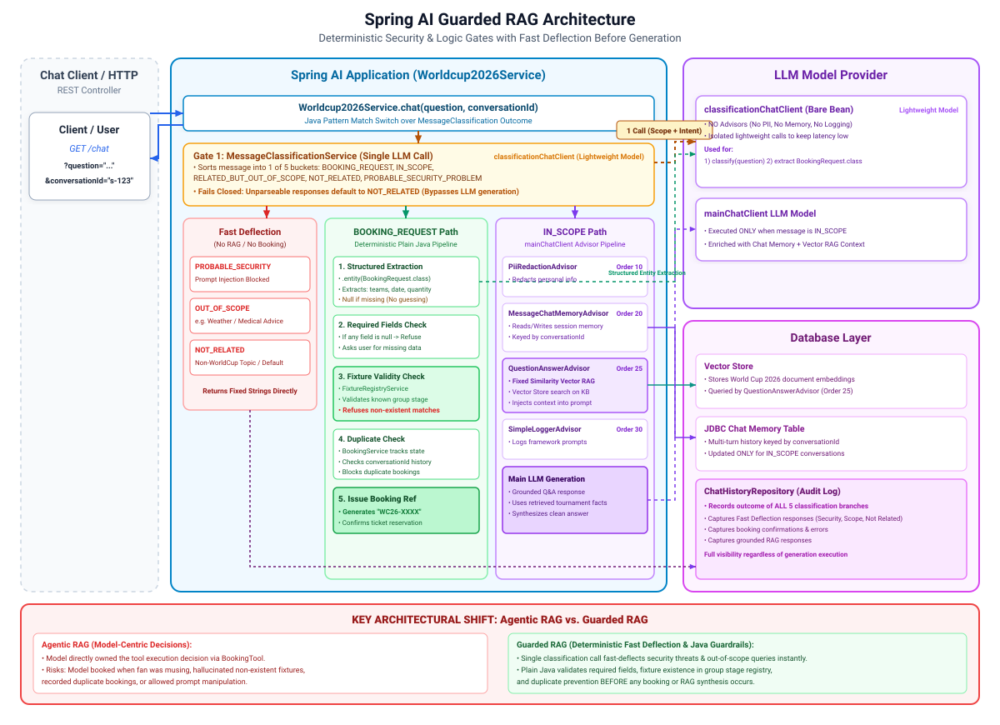

# 013-guarded-rag: Spring AI

Builds directly on `012-agentic-rag`. Same route, `GET /chat?question=&conversationId=`. Retrieval is still a fixed advisor that runs on every general
question, now `QuestionAnswerAdvisor` rather than `011-hybrid-search-rag`'s hand-rolled fusion, dropped from `012-agentic-rag` onward. Retrieval was
never the thing this arc needed to guard, it's a single correct answer per question and a fixed pipeline is the right shape for that. What changes is
who decides whether a message is even worth processing, whether it's a booking request, and whether that booking is actually valid.

**012's shape:** the model owns the whole decision. It gets a `bookMatchTicket` tool and decides, on its own judgement, whether a fan's message is
worth acting on. That's genuinely more flexible, and genuinely risky: nothing stopped it booking when the fan was only musing about a match, skipping
a booking it should have made, booking a fixture that never happened, recording the same booking twice, or answering a message that was never really a
question at all.

**013's shape:** none of that is the model's decision any more. `Worldcup2026Service` runs deterministic checks in plain Java before `BookingService`
ever records anything or generation ever runs:

1. **Classification**: `MessageClassificationService` sorts every message into one of five buckets before anything else happens, in a single call:
   `BOOKING_REQUEST` (an actual request to book tickets), `IN_SCOPE` (a real question that isn't a booking request), `RELATED_BUT_OUT_OF_SCOPE`
   (World Cup 2026-shaped but not something this assistant does, like booking a hotel or planning an itinerary), `NOT_RELATED` (nothing to do with the
   tournament at all), or
   `PROBABLE_SECURITY_PROBLEM`
   (an attempt to manipulate the assistant rather than ask it something). Only `IN_SCOPE` and
   `BOOKING_REQUEST` proceed; the other three return a fixed message and stop there. Fails closed:
   an answer that doesn't parse into one of the five labels is treated as `NOT_RELATED`, not let through. Booking intent used to be a second, separate
   LLM call here; folding it into classification instead means every in-scope message costs one call less than before, since the old flow always ran
   both regardless of the answer.
2. **Extraction**: a structured-output call (`.entity(BookingRequest.class)`) pulls the home team, away team, date and quantity out of the fan's
   message, with `null` for anything it isn't clearly told rather than a guess.
3. **Required fields**: `BookingService` refuses to book if any of the four fields came back
   `null`, with a message asking for what's missing.
4. **Fixture validity**: `FixtureRegistryService` is a small, deterministic, known-real subset of the group stage. A booking against a fixture that
   isn't in it is refused, no LLM judgement involved.
5. **Duplicate prevention**: `BookingService` tracks what's already been booked per conversation and refuses to record the same fixture-and-date
   twice.

Only a request that clears every check gets a booking reference, and only a message that clears classification reaches any of the rest. This matches
the series' oldest teaching device (001 hallucinates, 006 fixes it with tools): 012 was honest about the rough edges an agentic action-taking loop
produces, 013 is the fix, not because the model can't extract details correctly, but because whether to act, whether the request is even legitimate,
and whether the details support acting, already have correct answers that don't need the model's permission.

Added on top of `012-agentic-rag`:

* `model.MessageClassification` and `service.MessageClassificationService`, the new first gate, including booking intent: one call decides scope and
  intent together
* `model.BookingRequest` (extraction target), `service.FixtureRegistryService`,
  `service.BookingService`
* `classificationChatClient`, a bare `ChatClient` bean (flash-lite model, no advisors), shared by classification and structured extraction
* Packaging by model (`advisor`, `api`, `model`, `service`) instead of by feature: everything new in this module diverges from `012-agentic-rag`'s
  `booking` package and every later module's
  `guard`/`booking` split, which still organise by feature

Removed: `BookingTool` and `defaultTools(...)` on the three named chat clients. The controller no longer talks to a `ChatClient` directly at all; it
delegates to `Worldcup2026Service`. Also dropped, carrying `012-agentic-rag`'s change forward: `HybridSearchAdvisor`,
`FullTextSearchSchemaInitializer`,
`worldcup.hybrid-search.*`. Unchanged: `QuestionAnswerAdvisor` (order 25), `PiiRedactionAdvisor`
(10),
`MessageChatMemoryAdvisor` (20), `SimpleLoggerAdvisor` (30). Also unchanged: `ChatHistoryRepository` and `ChatHistorySchemaInitializer`, now injected
into `Worldcup2026Service` instead of the controller, recording every branch's outcome, not only the ones that reached generation.

---

## 1. Architecture

[](./docs/architecture.svg)

---

## 2. Configuration

No new dependency, and no `worldcup.hybrid-search.*` configuration, same as `012-agentic-rag`.

---

## 3. Source Code

The whole guard pipeline, in `Worldcup2026Service`:

```java
public String chat(final String question, final String conversationId) {
	return switch (messageClassificationService.classify(question)) {
		case RELATED_BUT_OUT_OF_SCOPE -> RELATED_BUT_OUT_OF_SCOPE_MESSAGE;
		case NOT_RELATED -> NOT_RELATED_MESSAGE;
		case PROBABLE_SECURITY_PROBLEM -> PROBABLE_SECURITY_PROBLEM_MESSAGE;
		case BOOKING_REQUEST -> bookingService.book(conversationId, extractBookingRequest(question));
		case IN_SCOPE -> respondInScope(question, conversationId);
	};
}

private String respondInScope(final String question, final String conversationId) {
	return mainChatClient.prompt().user(question)
			.advisors(advisor -> advisor.param(ChatMemory.CONVERSATION_ID, conversationId))
			.call().content();
}
```

Three of the five classification branches never touch the booking machinery or the advisor-grounded chat at all; the other two go straight to
whichever path they're for, `BOOKING_REQUEST` to booking and `IN_SCOPE` to `respondInScope(...)`, no separate intent check in between, classification
already decided it.

`BookingService` is where the actually deterministic booking decisions live:

```java
public String book(final String conversationId, final BookingRequest request) {
	if (request.homeTeam() == null || request.awayTeam() == null || request.date() == null || request.quantity() == null) {
		return "I need both teams, the date and how many tickets before I can book this.";
	}
	if (!fixtureRegistryService.exists(request.homeTeam(), request.awayTeam())) {
		return "I couldn't find a World Cup 2026 fixture between %s and %s.".formatted(request.homeTeam(), request.awayTeam());
	}
	// duplicate check, then record and return a reference
}
```

Every one of those checks is plain Java over already-known data: no LLM call decides whether a fixture is real or whether a booking already happened.
The only LLM calls anywhere in this pipeline are classification and field extraction, both narrow, both feeding a code decision, not making one.

`classificationChatClient` is deliberately bare: no `PiiRedactionAdvisor`, no
`MessageChatMemoryAdvisor`, no `SimpleLoggerAdvisor`:

```java

@Bean
public ChatClient classificationChatClient(final ChatClient.Builder builder,
		@Value("${spring.ai.google.genai.chat.flash-lite-model}") final String model) {
	return builder.defaultOptions(getGeminiChatOptions(model)).build();
}
```

None of the classification or extraction calls are part of the fan's actual conversation, so neither should be written into Postgres-backed chat
memory alongside it.

---

## 4. Running and Testing

Same as `012-agentic-rag`: Postgres and `010-embedding` (at least once) must both have run first.

* `docker compose up -d postgres`
* Start the application
* Check and run [Requests.http](src/test/resources/Requests.http)

---

## 5. References

* [Anthropic - Building effective agents](https://www.anthropic.com/engineering/building-effective-agents)
* [Spring AI - Building Effective Agents](https://docs.spring.io/spring-ai/reference/api/effective-agents.html)

---

## 6. Exercise

Try the [exercise](EXERCISE.md) before opening `014-query-optimised-rag`.
