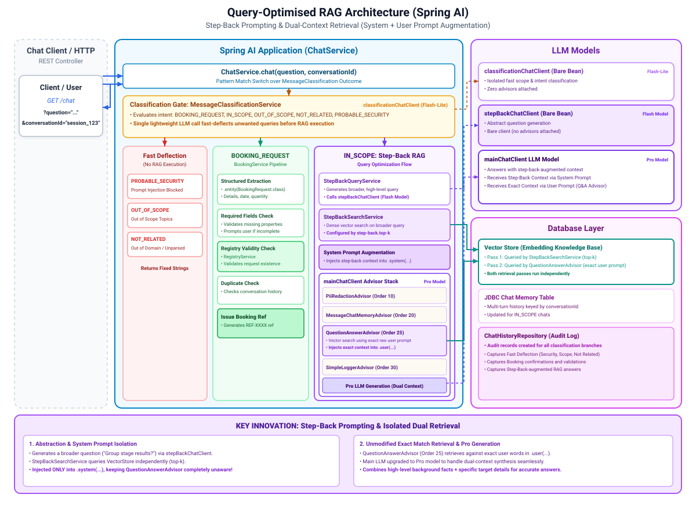

# 014-query-optimised-rag: Spring AI

Builds directly on `013-guarded-rag`. Same route, `GET /chat?question=&conversationId=`. The classification gate and the booking path are both
unchanged: `MessageClassificationService` still decides scope and booking intent in one call, `BookingService` still handles anything that's actually
a booking request. What's new is what happens to a general question once it clears classification: instead of answering straight off
`QuestionAnswerAdvisor`'s retrieval, the pipeline now generates a broader, step-back version of the question first, retrieves against that too, and
answers with both.

**Step-back prompting** (Zheng et al., "Take a Step Back: Evoking Reasoning via Abstraction"): a specific question, answered by retrieving only
against its exact wording, can miss useful background a broader question would have surfaced. "Who scored for Morocco against Haiti" is exact enough
that retrieval usually finds it directly, but the technique generalises: ask the model to abstract the question into something broader ("What were
Morocco's group stage results?"), retrieve against *that* too, and let the answering model draw on both. Retrieving on the step-back query
**augments**
the original search, it never replaces it: `QuestionAnswerAdvisor` still retrieves against the fan's exact words, exactly as it has since
`012-agentic-rag`, completely unaware anything else is happening.

The two retrieval passes never touch each other's code. `StepBackSearchService` is a small, deliberately separate class doing the same plain dense
vector search `QuestionAnswerAdvisor` does, just against the step-back query instead of the fan's raw question. Sharing code would have meant editing
the advisor to expose its retrieval, and the advisor already works correctly. The step-back context is injected into the **system** prompt, never the
user message, specifically so
`QuestionAnswerAdvisor`'s own retrieval (which reads the *user* message to decide what to search for)
never sees it and never searches against anything other than the fan's actual words.

Added on top of `013-guarded-rag`:

* `service.query.StepBackQueryService`, flash model, bare client, generates the broader question
* `service.query.StepBackSearchService`, the same dense vector search as `QuestionAnswerAdvisor`, run against the step-back query only
* `stepBackChatClient`, a new bare `ChatClient` bean (flash model, no advisors)
* `mainChatClient` switches from the flash model `013-guarded-rag` used to the pro model, now that it answers with step-back-augmented context instead
  of a plain grounded response

Unchanged: `classificationChatClient` (flash-lite, bare), `QuestionAnswerAdvisor` (order 25, byte-for-byte identical to
`013-guarded-rag`),
`PiiRedactionAdvisor` (10), `MessageChatMemoryAdvisor` (20), `SimpleLoggerAdvisor` (30),
`MessageClassificationService`, `BookingService`, `ChatHistoryRepository`, `ChatHistorySchemaInitializer`.

---

## 1. Architecture

[](./docs/architecture.svg)

---

## 2. Configuration

No new dependency. One new property, `worldcup.step-back.top-k`, sizing `StepBackSearchService`'s retrieval independently of whatever
`QuestionAnswerAdvisor` uses.

---

## 3. Source Code

`Worldcup2026Service.respondInScope(...)`, reached only once classification has already returned
`IN_SCOPE`, not `BOOKING_REQUEST`:

```java
private String respondInScope(final String question, final String conversationId) {
	final String stepBackQuery = stepBackQueryService.generateStepBackQuery(question);
	final Optional<String> stepBackContext = stepBackSearchService.search(stepBackQuery);

	return mainChatClient.prompt()
			.system(systemPrompt(stepBackQuery, stepBackContext))
			.user(question)
			.advisors(advisor -> advisor.param(ChatMemory.CONVERSATION_ID, conversationId))
			.call().content();
}
```

`question` goes into `.user(...)` exactly as it always has; `QuestionAnswerAdvisor`, still attached to
`mainChatClient`, retrieves against that unmodified text and replaces the user message with its own question-plus-context, exactly as before. The
step-back context lands in `.system(...)`
instead, which the advisor never touches:

```java
private static String systemPrompt(final String stepBackQuery, final Optional<String> stepBackContext) {
	return stepBackContext.map(s -> BASE_SYSTEM_PROMPT + """
			
			Additional background, retrieved using a broader version of the question ("%s"):
			---------------------
			%s
			---------------------
			""".formatted(stepBackQuery, s)).orElse(BASE_SYSTEM_PROMPT);
}
```

By the time generation runs, the model sees two independently-retrieved sources: whatever
`QuestionAnswerAdvisor` found for the exact question (in the user message) and whatever
`StepBackSearchService` found for the broader one (in the system message). Neither retrieval call knows the other exists.

`StepBackQueryService` is a single, narrow prompt:

```java
public String generateStepBackQuery(final String question) {
	return stepBackChatClient.prompt()
			.system(""" ... write one broader, more general question ... """)
			.user(question)
			.call().content();
}
```

---

## 4. Running and Testing

Same as `013-guarded-rag`: Postgres and `010-embedding` (at least once) must both have run first.

```bash
docker compose up -d                                    # from the repository root
cd ../010-embedding && ./mvnw spring-boot:run           # ingest the knowledge base, once
cd ../014-query-optimised-rag && ./mvnw spring-boot:run  # this module
```

```bash
curl "http://localhost:8080/chat?question=Who was named Man of the Match in Uzbekistan vs Colombia?&conversationId=014"
```

Watch `advisor: DEBUG`: `QuestionAnswerAdvisor` logs the exact question it retrieved against, unchanged from every earlier module. There's no
equivalent log line for `StepBackSearchService`
(it isn't an advisor), so the clearest way to see the step-back query it actually generated is to add a temporary log statement in
`StepBackQueryService`, or watch the system prompt Gemini receives if you have request logging enabled at the HTTP client level.

---

## 5. Reference

* [Step-back prompting](https://www.langchain.com/blog/query-transformations#step-back-prompting)

---

## 6. Exercise

Try the [exercise](EXERCISE.md) before opening `009-chat-history`.
