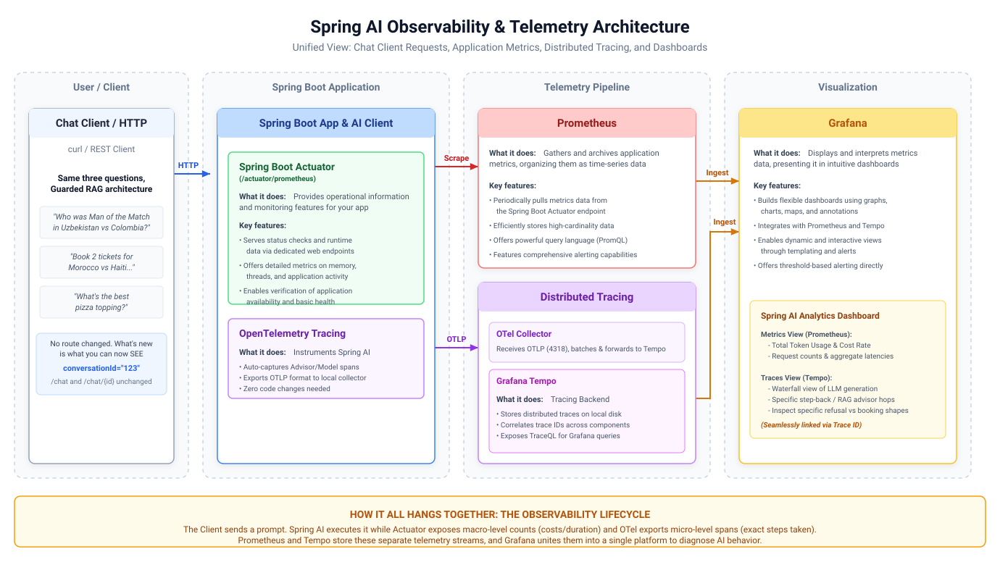

# 015-Observability: Spring AI

Java code is unchanged from previuso module.

> Spring AI observability features in the Spring ecosystem to provide insights into AI-related operations. It provides metrics and tracing
> capabilities for its core components: `ChatClient` (including `Advisor`), `ChatModel`, `EmbeddingModel`, `ImageModel`, and `VectorStore`.

Spring AI instruments all of this itself, via Micrometer, as soon as the observability infrastructure (Micrometer plus a tracer) is on the classpath.
This module wires up the plumbing to actually receive them: Actuator, a Prometheus registry, and tracing exported to Zipkin, so a single `/chat`
request becomes one trace with a span per hop instead of a pile of disconnected log lines.

> [!Note]
>Nothing in this module writes fan questions or model output into a trace or a log. Spring AI's `spring.ai.chat.client.observations.log-prompt`,
`spring.ai.chat.client.observations.log-completion` and `spring.ai.vectorstore.observations.log-query-response` properties all default to `false`
and stay that way, documented (commented out and not enabled) in `application.yaml`.

> [!Caution]
>Turning `log-prompt`, `log-completion` and `log-query-response` on is an option for local debugging, and a real risk everywhere else.

---

## 1. Architecture

[](./docs/architecture.svg)

---

## 2. Configuration

```xml

<dependency>
  <artifactId>spring-boot-starter-actuator</artifactId>
  <groupId>org.springframework.boot</groupId>
</dependency>

<dependency>
<artifactId>spring-boot-starter-opentelemetry</artifactId>
<groupId>org.springframework.boot</groupId>
</dependency>

<dependency>
<artifactId>micrometer-registry-prometheus</artifactId>
<groupId>io.micrometer</groupId>
</dependency>
```

```yaml
management:
  prometheus:
    metrics:
      export:
        enabled: true
  endpoints:
    web:
      exposure:
        include: "*"
  endpoint:
    health:
      show-details: always
  tracing:
    sampling:
      probability: 1.0
  opentelemetry:
    tracing:
      export:
        otlp:
          endpoint: http://localhost:4318/v1/traces
```

`docker-compose.yml` (repository root) gained a `zipkin`, `prometheus` and `otel-collector` services alongside the existing Postgres container.

---

## 2. Source Code

There is no new Java in this module. All telemetry Spring AI produces comes from code that already existed in `014-query-optimised-rag`; what changed
is that Micrometer and a tracer are now on the classpath.

---

## 3. Running and Testing

* `docker compose up -d postgres`
* Start the application
* Check and run [Requests.http](src/test/resources/Requests.http)
* Go to [zipkin](http://localhost:9411/zipkin) to check traces
* Go to [Spring actuator](http://localhost:8080/actuator/metrics), [Prometheus](http://localhost:9090)

Now compare a step-back trace against the trace for a booking request or classification refusal:

* Full in-scope chat queries generate a complete trace containing `spring_ai.chat_client`, `spring_ai.advisor`, `db.vector.client.operation`, and
  `gen_ai.client.operation` spans across classification, step-back rewriting, dual vector retrieval, advisor chains, and final answer synthesis.
* Booking requests produce a shorter trace containing only two `gen_ai.client.operation` spans for classification and structured extraction, bypassing
  vector search and advisor execution entirely.
* Out-of-scope deflection requests create the shortest trace, recording a single `gen_ai.client.operation` span for classification before halting
  further downstream operations.

---

## 5. References

* [Spring AI - Observability](https://docs.spring.io/spring-ai/reference/observability/index.html)
* [OpenTelemetry — Semantic Conventions for Generative AI (overview)](https://opentelemetry.io/docs/specs/semconv/gen-ai/)
* [Micrometer — Naming Meters](https://docs.micrometer.io/micrometer/reference/concepts/naming.html)
* [Spring Boot - actuator](https://docs.spring.io/spring-boot/reference/actuator/metrics.html)
* [Spring Boot - tracing](https://docs.spring.io/spring-boot/reference/actuator/tracing.html)
* [AI for Java Developers by Dan Vega](https://www.youtube.com/watch?v=FzLABAppJfM)

---

## 5. Exercise

Try the [exercise](EXERCISE.md) before opening `016-evaluation`.
