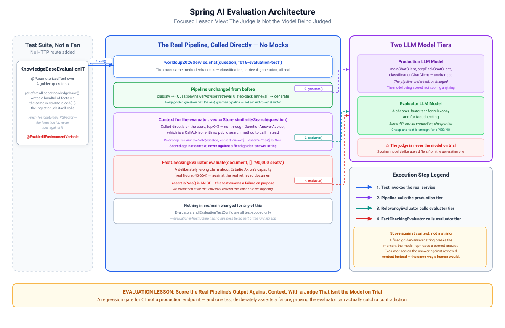

# 016-Evaluation: Spring AI

This module just adds non-deterministic tests, `KnowledgeBaseEvaluationIT`, that scores the production pipeline's answers against Spring AI's own
evaluators (e.g. `RelevancyEvaluator` and `FactCheckingEvaluator`). This module does not add any new production code at all.

> Evaluate the response is to use the AI model itself for evaluation. Select the best AI model for the evaluation, which may not be the same model
> used to generate the response.
>
> -- [Spring AI - Evaluation Testing](https://docs.spring.io/spring-ai/reference/api/testing.html)

**Why an evaluator instead of a golden-answer string match.** A fixed expected string ("Ma Ning is from China") breaks the moment the model rephrases
a correct answer a different way. Spring AI's `Evaluator` interface scores an answer against context instead of against an exact string:
`RelevancyEvaluator` checks whether the response is actually in line with the retrieved context (catches the model answering something unrelated to
what it retrieved), `FactCheckingEvaluator` checks whether a claim is supported by a document (catches a claim that contradicts the evidence
outright). Both delegate to a real LLM call to make that judgement.

* `KnowledgeBaseEvaluationIT`, a real (not mocked) end-to-end test: seeds a small fixture set of facts directly into the `Testcontainers PGVector`
  instance, then runs each golden question through the actual `Worldcup2026Service.chat(...)`, the same code path `/chat` uses, and scores the result
* `EvaluationTestConfig`, test-scoped only: two extra beans, `RelevancyEvaluator` and `FactCheckingEvaluator`, both built on the same auto-configured
  `ChatClient.Builder`
* Nothing in `src/main` changed

> [!Note]
>A cheap, fast model is genuinely enough for a YES/NO-shaped judgement even when the generation model is much larger. Both evaluators need the
`GOOGLE_AI_API_KEY`

---

## 1. Architecture

[](./docs/architecture.svg)

---

## 2. Test Configuration

### `EvaluationTestConfig`

Defines two RelevancyEvaluator` and `FactCheckingEvaluator beans using a cheap and fast test-scoped only model built on the same auto-configured
`ChatClient.Builder`

```java

@Bean
RelevancyEvaluator relevancyEvaluator(final ChatClient.Builder builder,
		@Value("${spring.ai.google.genai.chat.flash-lite-model}") final String model) {
	return RelevancyEvaluator.builder().chatClientBuilder(evaluationChatClientBuilder(builder, model)).build();
}

@Bean
FactCheckingEvaluator factCheckingEvaluator(final ChatClient.Builder builder,
		@Value("${spring.ai.google.genai.chat.flash-lite-model}") final String model) {
	return FactCheckingEvaluator.builder(evaluationChatClientBuilder(builder, model)).build();
}

private static ChatClient.Builder evaluationChatClientBuilder(final ChatClient.Builder builder, final String model) {
	return builder.defaultOptions(GoogleGenAiChatOptions.builder().model(model).temperature(0.0));
}
```

> [!Note]
> There is no tools, advisor, or any other heavy machinery with these evaluators

---

## 3. Test Code

### Test-scoped Vector database

```java
static final PostgreSQLContainer postgres =
		new PostgreSQLContainer(DockerImageName.parse("pgvector/pgvector:pg17").asCompatibleSubstituteFor("postgres"));

static {
	postgres.start();
}

@BeforeAll
void seedKnowledgeBase() {
	vectorStore
			.add(List
					.of(new Document("Ma Ning (China) served as a head referee at the FIFA World Cup 2026."),
							new Document("Alireza Faghani (Australia) served as a head referee at the FIFA World Cup 2026."),
							new Document("Estadio Akron has a seating capacity of 45,664 and hosted FIFA World Cup 2026 matches."),
							new Document("Kylian Mbappé recorded 10 goals, 4 assists and 1 Man of the Match award during the FIFA World Cup 2026 group stage.")));
}
```

Every module since `010-vector-store-rag` has relied on `010-embedding` having already ingested the full generated knowledge base into the *real*
Postgres instance from `docker-compose.yml`. The Testcontainers PGVector instance this test spins up is a fresh, empty container.
`010-embedding`'s ingestion never runs against it. `seedKnowledgeBase()` writes a handful of the exact facts the golden questions need, via the same
`VectorStore.add(...)` call `010-embedding` itself makes, just for a small fixture instead of the full knowledge base.
`@TestInstance(Lifecycle.PER_CLASS)` is what makes a non-static `@BeforeAll` legal here: it needs `@Autowired VectorStore vectorStore`, which only
exists on the test instance, not statically.

### Relevancy Test

```java
private static Stream<Arguments> goldenQuestions() {
	return Stream
			.of(Arguments.of("Which country is the referee Ma Ning from?"),
					Arguments.of("Which country is the referee Alireza Faghani from?"),
					Arguments.of("What is the seating capacity of Estadio Akron?"),
					Arguments.of("How many goals and assists does Kylian Mbappé have?"));
}

@ParameterizedTest
@MethodSource("goldenQuestions")
void answerIsRelevantToRetrievedContext(final String question) {
	final SearchRequest searchRequest = SearchRequest.builder()
			.query(question)
			.topK(3)
			.build();

	final List<Document> context = vectorStore.similaritySearch(searchRequest);

	assertThat(context)
			.as("Expected retrieval to find context for: " + question)
			.isNotEmpty();

	final String answer = worldcup2026Service.chat(question, "016-evaluation-test");

	final EvaluationRequest evaluationRequest = new EvaluationRequest(question, context, answer);

	final EvaluationResponse response = relevancyEvaluator.evaluate(evaluationRequest);

	assertThat(response.isPass()).
			as(response.getFeedback())
			.isTrue();
}
```

Four golden questions run through this, each hitting the real `MessageClassificationService`, `QuestionAnswerAdvisor` and the step-back retrieval from
`014-query-optimised-rag`. Then the `RelevancyEvaluator` evaluates the actual production pipeline's output. Context for the evaluator itself comes
from `VectorStore.similaritySearch(...)` call running against the test-scoped vector database.

### Fact Checking Test

```java
@Test
void factCheckingCatchesAContradictedClaim() {
	final SearchRequest searchRequest = SearchRequest.builder()
			.query("What is the seating capacity of Estadio Akron?")
			.topK(1)
			.build();

	final List<Document> context = vectorStore.similaritySearch(searchRequest);

	assertThat(context)
			.as("Expected retrieval to find Estadio Akron's capacity")
			.isNotEmpty();

	final String answer = worldcup2026Service.chat(context.getFirst().getText(), "016-evaluation-test");

	final EvaluationRequest evaluationRequest =
			new EvaluationRequest("Estadio Akron has a seating capacity of 90,000.", List.of(), answer);

	final EvaluationResponse response = factCheckingEvaluator.evaluate(evaluationRequest);

	assertThat(response.isPass())
			.as(response.getFeedback())
			.isFalse();
}
```

This one asserts a **failure**: a deliberately wrong claim (90,000, the real figure is 45,664) should not pass fact-checking against the real
retrieved document.

---

## 4. References

* [Spring AI - Evaluation Testing](https://docs.spring.io/spring-ai/reference/api/testing.html)
